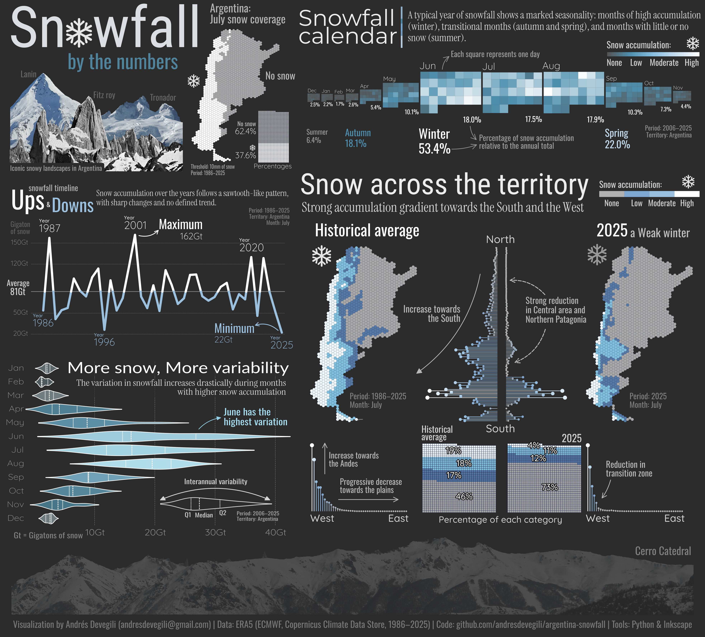

# Datos sobre nieve en Argentina

## Español

### Descripción

Este repositorio contiene datasets y cuadernos Jupyter en Python (`.ipynb`) para analizar y visualizar las tendencias de nevadas en Argentina (1985--2025).

El proyecto fue desarrollado para la producción de una **infografía** presentada al concurso **Contar con Datos 2025**.

El notebook (.ipynb) genera los **paneles individuales de visualización**, que luego los **integré manualmente en una infografía final usando Inkscape**.

El script y la infografía está disponibles en una versión en **español**.

<p align="center">
  
</p>

### Dataset

-   **Formato:** Archivos Parquet (`.parquet`)\
-   **Contenido:** Estimaciones diarias e interanuales de acumulación de nieve en Argentina\
-   **Fuente:** Derivados de datos de reanálisis climático (ERA5, ECMWF, Copernicus Climate Data Store)

### Disponibilidad de los datos

Al conjunto de datos lo descargué de [reanalysis ERA5]([https://cds.climate.copernicus.eu/cdsapp#!/dataset/reanalysis-era5-single-levels](https://cds.climate.copernicus.eu/datasets/reanalysis-era5-single-levels?tab=overview)) a través del *Copernicus Climate Data Store* (CDS).  
ERA5 provee estimaciones horarias de un gran número de variables atmosféricas, terrestres y oceánicas.

Para este proyecto descargué datos de nevadas (snowfall) sobre el cuadrante correspondiente de Argentina  y para el período 1986–2025.  

- ERA5 hourly data on single levels from 1940 to present  
- Extensión espacial:  
  - Norte: -21.70°  
  - Oeste: -73.50°  
  - Sur: -55.20°  
  - Este: -53.50° 

**Nota**  
Los datos crudos de ERA5 fueron posteriormente **curados y posprocesados** en el cuaderno de Jupyter (`snowfall_july_2006_2025_ARG-español.ipynb`) para filtrar la región de estudio, agregar valores y generar el conjunto final utilizado en los análisis y visualizaciones.

### Visualizaciones

-   El código produce **paneles individuales**:
    -   Series temporales\
    -   Mapas\
    -   Gráficos de waffle\
    -   Gráficos de lollipop\
-   Los paneles son luego combinados en **infografías finales** (integradas en Inkscape).\

### Requerimientos

-   Python 3.9+\
-   Librerías principales: `pandas`, `matplotlib`, `geopandas`, `shapely`, `xarray`\
-   Para la integración final: [Inkscape](https://inkscape.org) (paso manual)

### Tipografías

Las visualizaciones utilizan tipografías de [Google Fonts](https://fonts.google.com).\
- Asegurate de instalarlas localmente o enlazarlas en el notebook.\
- *Roboto*, *Oswald*, *Intrument serif*, *Lato*, *Inter*, and *Montserrat*

### Estructura del repositorio

``` text
argentina-snowfall/
├── data/            # Datasets en Parquet
├── notebooks/       # Notebooks Jupyter (.ipynb) en ENG y ESP
├── figures/         # Paneles individuales (.png, .svg)
├── infographics/    # Infografía final (PNG, PDF)
├── README.md        # Documentación del proyecto
├── LICENSE          # Licencia
└── .gitignore        
```

### Licencia

-   **Código:** Licencia MIT (ver [LICENSE](LICENSE))\
-   **Figuras e infografías:** Por favor, acreditarme si reutilizas las visualizaciones o infografía.

------------------------------------------------------------------------

# Argentina Snowfall

## English

### Description

This repository contains datasets and Python Jupyter notebooks (`.ipynb`) for analyzing and visualizing snowfall trends in Argentina (1985--2025).

The project was developed to produce an infographic submitted to the **Contar con Datos 2025** contest.

The Python scripts (.ipynb) generate **individual visualization panels**. Later, I integreted these panels **into a full infographic using Inkscape**.

Scripts and infographic are available in **English** version.

<p align="center">
  
</p>

### Dataset

-   **Format:** Parquet (`.parquet`)\
-   **Content:** Daily to interannual estimates of snowfall accumulation across Argentina\
-   **Source:** Derived from reanalysis climate data (ERA5, ECMWF, Copernicus Climate Data Store)

### Data Availability

I downloaded the dataset from the [ERA5 reanalysis](https://cds.climate.copernicus.eu/cdsapp#!/dataset/reanalysis-era5-single-levels) via the Copernicus Climate Data Store (CDS).  
ERA5 provides hourly estimates of a large number of atmospheric, land, and oceanic variables.

For this project, I retrieved snowfall data over Argentina for the period 1986–2025.

- ERA5 hourly data on single levels from 1940 to present  
- Spatial domain:  
  - North: -21.70°  
  - West: -73.50°  
  - South: -55.20°  
  - East: -53.50°

**Note**  
The raw ERA5 data was later **curated and post-processed** in the accompanying Jupyter notebook (`snowfall_july_2006_2025_ARG-english.ipynb`) to filter the study region, aggregate values, and generate the final dataset used for analysis and visualization.

### Visualizations

-   Code produces **individual panels**:
    -   Time series\
    -   Maps\
    -   Waffle charts\
    -   Lollipop plots\
-   Panels are then assembled into **final infographics** (done externally in Inkscape).\

### Requirements

-   Python 3.9+\
-   Libraries: `pandas`, `matplotlib`, `geopandas`, `shapely`, `xarray`\
-   For final assembly: [Inkscape](https://inkscape.org) (manual integration step)

### Fonts

Visualizations rely on fonts from [Google Fonts](https://fonts.google.com).\
- Make sure the fonts are installed locally or linked in the notebook.\
- *Roboto*, *Oswald*, *Intrument serif*, *Lato*, *Inter*, and *Montserrat*

### Repository structure

``` text
argentina-snowfall/
├── data/            
├── notebooks/       
├── figures/         
├── infographics/    
├── README.md        
├── LICENSE          
└── .gitignore        
```

### License

-   **Code:** MIT License (see [LICENSE](LICENSE))\
-   **Figures and visualizations:** Please credit author when reusing outputs.

------------------------------------------------------------------------
